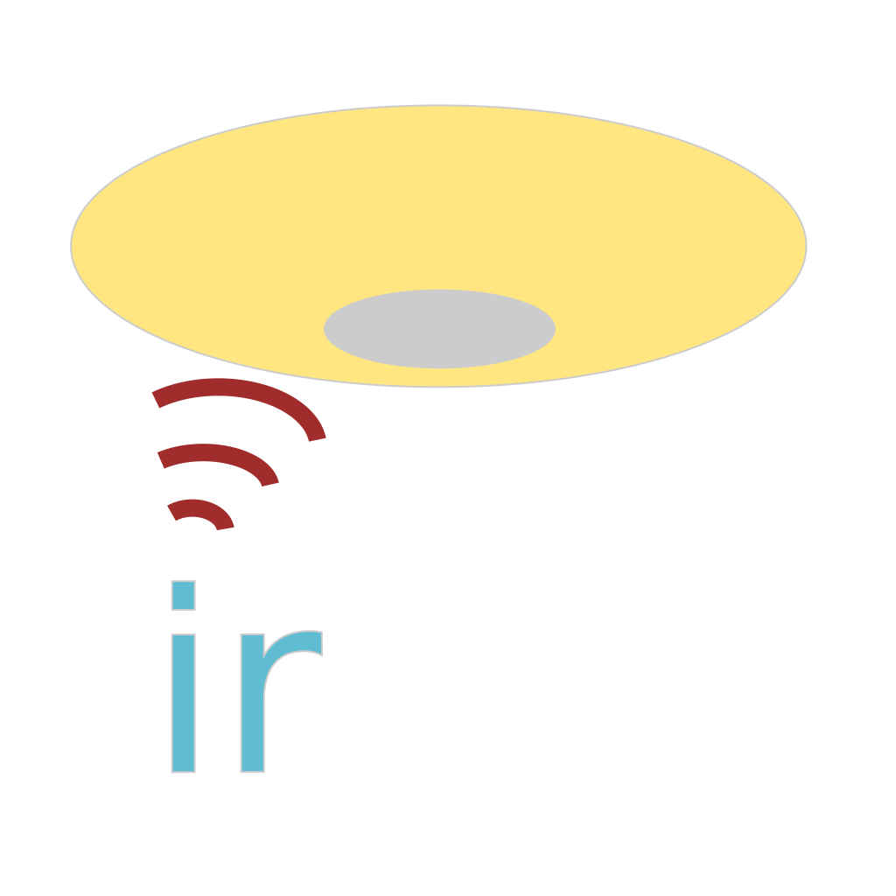

**This software is currently beta quality** Basic single commands work, but repeated commands may have issues, making brightness and color temperature control erratic, at least on Tuya emitters (which could just as well be an issue with those devices or the tuya-local implementation of infrared as with this integration).

Please report any [issues](https://github.com/make-all/infrared-light/issues) and feel free to raise [pull requests](https://github.com/make-all/infrared-light/pulls).

This is a Home Assistant integration to support lights controllable via infrared emitters.
For details of infrared device setup, see the [Home Assistant documentation](https://www.home-assistant.io/integrations/infrared/)

### Functional details

**Basic turn on/off** is of course supported. For lights that support a memory function, turn on uses the memory recall function, and turn off invokes a save memory command before the turn off.

**Brightness** is supported for lights that use up/down buttons. When the brightness reaches the top or bottom of the range, extra commands will be issued to ensure the light is in sync with HA's assumed state.

**Color temperature** is supported for lights that use up/down buttons. As with brightness, at the top or bottom of the range, extra commands will be issued to ensure the light is in sync.

**RGB colors** are not currently supported.

**Nightlight** feature common on ceiling lights is supported by mapping the nightlight to a `brightness_value` of 1. This is generally not selectable from the UI, so cannot be accidentally toggled, but can be sent from automations (which can be triggered by a dedicated button).

**Remote protocols** Currently only remotes using NEC based protocols (including NEC Extended) are supported.
Low level protocol support is provided by the infrared-protocols library, maintained by the Home Assistant team.

### Supported lights:

- NEC lights with RE0201 remote (CH1 and CH2 supported)
- Takizumi lights with TLR-002 remote
- Aconic lights with LED Controller 24key remote
- Silvercrest lights with 14135502L remote
- Toshiba lights with FRC-199T remote
